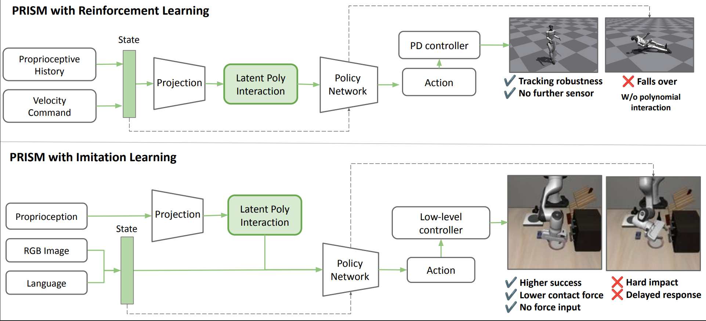

<h1 align="center">PRISM</h1>

<h3 align="center">
  Polynomial Representations for Interaction-Structured Motor Control
</h3>

<p align="center">
  <strong>Seung Hyun Lee</strong> &middot; <strong>Stella X. Yu</strong>
</p>

<p align="center">
  <a href="https://lsh3163.github.io/prism/"><strong>Project Page</strong></a>
  &nbsp;&middot;&nbsp;
  <a href="https://arxiv.org/abs/2607.23473"><strong>arXiv</strong></a>
  &nbsp;&middot;&nbsp;
  <a href="https://arxiv.org/pdf/2607.23473"><strong>Paper PDF</strong></a>
  &nbsp;&middot;&nbsp;
  <a href="RESULTS.md"><strong>Results</strong></a>
  &nbsp;&middot;&nbsp;
  <a href="REPRODUCIBILITY.md"><strong>Reproducibility</strong></a>
</p>

<p align="center">
  
  
  
  <a href="https://arxiv.org/abs/2607.23473"></a>
</p>

<p align="center">
  <a href="https://lsh3163.github.io/prism/">
    
  </a>
</p>

PRISM adds learned polynomial interactions to a policy's proprioceptive branch.
This repository provides a standalone PyTorch conditioner and integrations for
G1 PPO, Diffusion Policy, BFM-Zero, and SmolVLA.

All default PRISM training recipes use the same learned gated interaction:
`u = A1(x)`, `v = A2(x)`, `phi = u * (1 + alpha * v)`. Each latent feature has
its own trainable `alpha`, initialized to 0.01 and optimized with the policy's
existing loss. Observation preprocessing, output projections, and policy
backbones remain specific to each integration.

G1 and Diffusion now use new gated actor versions. Their historical actors and
checkpoints remain available through explicit legacy recipes. Existing G1 and
Diffusion results do not evaluate the new gated versions; new training and
evaluation are required. See the [migration guide](GATED_MIGRATION.md).

## Quick start

```bash
git clone https://github.com/lsh3163/prism.git
cd prism
uv sync --extra test --extra dev
make check
```

The core supports Python 3.10+. Simulator integrations use separate environments
and pinned upstream revisions; follow their installation guides below.

```python
import torch
from prism_robot import PRISMConditioner

conditioner = PRISMConditioner(
    input_dim=32,
    output_dim=1152,
    hidden_dim=1152,
    degree=2,
    interaction_mode="gated",
    gate_init=1e-2,
    post_mlp_layers=2,
    use_rmsnorm=True,
)
features = conditioner(torch.randn(8, 32))
assert features.shape == (8, 1152)
```

`conditioner.polynomial_features(x)` returns the interaction features before
the output projection. The shared API supports gated and factorized modes.
Existing backbone checkpoints use the specific adapters listed below.

## Choose an integration

| Backbone | Representation | Guide |
|---|---|---|
| G1 PPO | Learned gated encoder; degree 2 by default, degree 1/2/3 ablations | [Humanoid-Gym integration](integrations/humanoid-gym/README.md) |
| LeRobot Diffusion | Learned gated quadratic state-history conditioner | [Diffusion setup and experiments](integrations/lerobot/README.md) |
| BFM-Zero | Gated quadratic filter on `history_actor` | [Pinned patches](integrations/README.md), [training and evaluation](REPRODUCIBILITY.md#bfm-zero) |
| LeRobot SmolVLA | Gated quadratic proprioceptive projection | [LeRobot integration](integrations/lerobot/README.md), [protocol](REPRODUCIBILITY.md#smolvla) |

These adapters share the gated interaction and preserve their own interfaces and
checkpoint schemas. Use the
[actor contracts](ACTOR_CONTRACT.md) and [architecture registry](configs/actor_contracts.json)
to select the correct loader, normalization, feature ordering, and gate or warmup
behavior. The standalone conditioner does not convert an existing checkpoint.

## Documentation

- [Experiments](EXPERIMENTS.md): simulation workflows, analyses, and protocol controls.
- [Gated migration](GATED_MIGRATION.md): shared algorithm, version selection, and retraining scope.
- [Reproducibility](REPRODUCIBILITY.md): shared run metadata and stronger-backbone recipes.
- [Real demonstration](REAL_DEMO.md): train and deploy the same LeRobot policy on your robot.
- [Validation](validation/README.md): CPU checks and portable checkpoint inventory.
- [Simulator checks](validation/SMOKE_REPORT.md): completed G1 and LIBERO execution checks.
- [Learned-gate checks](validation/GATED_REPORT.md): optimizer, checkpoint, and short training validation.
- [Results](RESULTS.md): archived stronger-backbone measurements and their scope.
- [Contributing](CONTRIBUTING.md): code conventions and checks.

## Repository layout

```text
src/prism_robot/    Standalone PyTorch conditioner
integrations/      Pinned adapters, installers, and experiment runners
configs/           Actor contracts and training recipes
analysis/          Representation probes, plots, and metric aggregation
validation/        Portable checkpoint inventory and validation notes
tests/             CPU checks of models, interfaces, and release tools
```

Checkpoints, datasets, simulator assets, generated results, and local audit
records remain outside the source distribution. Setup, smoke evaluation, and
full benchmark reproduction are distinct validation stages; completed checks
are recorded in the validation report.

## Citation

```bibtex
@article{lee2026prism,
  title = {PRISM: Polynomial Representations for Interaction-Structured Motor Control},
  author = {Lee, Seung Hyun and Yu, Stella X.},
  journal = {arXiv preprint arXiv:2607.23473},
  year = {2026},
  doi = {10.48550/arXiv.2607.23473},
  url = {https://arxiv.org/abs/2607.23473}
}
```

## Licensing

A top-level license for the standalone PRISM implementation is being
finalized. The integration patches remain subject to their respective
BFM-Zero and LeRobot upstream terms. See [NOTICE.md](NOTICE.md) before
redistribution.
