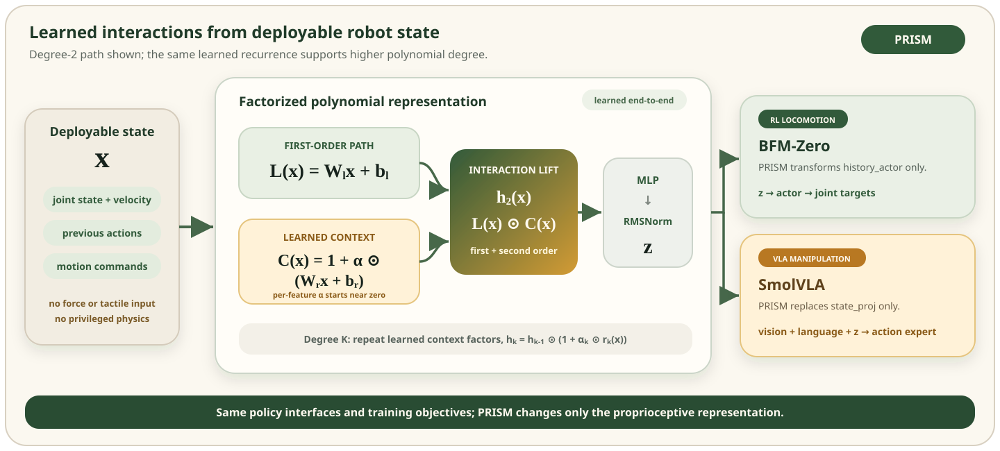

<h1 align="center">PRISM</h1>

<h3 align="center">
  Polynomial Representations for Interaction-Structured Motor Control
</h3>

<p align="center">
  <strong>Seung Hyun Lee</strong> &middot; <strong>Stella X. Yu</strong>
</p>

<p align="center">
  <a href="https://lsh3163.github.io/prism/"><strong>Project Page</strong></a>
  &nbsp;&middot;&nbsp;
  <a href="https://lsh3163.github.io/prism/assets/prism/prism-paper.pdf"><strong>Paper PDF</strong></a>
  &nbsp;&middot;&nbsp;
  <a href="RESULTS.md"><strong>Results</strong></a>
  &nbsp;&middot;&nbsp;
  <a href="REPRODUCIBILITY.md"><strong>Reproducibility</strong></a>
</p>

<p align="center">
  
  
  
</p>

> **Motivation.** Robot policies observe individual state coordinates, while
> physical behavior depends on how joint, velocity, command, contact, and load
> effects interact. PRISM makes these couplings learnable from deployable
> proprioception, without adding force sensors, tactile input, contact labels,
> or privileged physical parameters.

PRISM is a compact, learnable polynomial representation for motor-control
policies. It changes only the proprioceptive representation presented to the
policy backbone and can be inserted into both reinforcement-learning and
vision-language-action policies.

## Method

<p align="center">
  
</p>

For proprioceptive input $x$, PRISM forms a first-order path and recursively
introduces learned interaction factors:

$$
\begin{aligned}
h_1 &= W_1x+b_1, \\
h_k &= h_{k-1}\odot
\left(1+\alpha_k\odot(W_kx+b_k)\right),
\qquad k=2,\ldots,K, \\
z &= \operatorname{RMSNorm}\!\left(\operatorname{MLP}(h_K)\right).
\end{aligned}
$$

Each $\alpha_k$ is learned independently for every latent feature. Initializing
these scales near zero preserves a strong first-order path at the start of
training, while optimization determines where higher-order interactions are
useful. Expanding the recurrence yields a representation of degree at most
$K$. The reported stronger-backbone experiments use $K=2$; the implementation
also supports higher degrees and a direct factorized-polynomial mode.

## Stronger-Backbone Results

PRISM improves both backbones while remaining substantially closer in size to
the original model than the larger-capacity control.

| Backbone | Evaluation metric | Baseline | Larger control | **PRISM** |
|---|---|---:|---:|---:|
| BFM-Zero | Mean tracking EMD $\downarrow$ | 1.269 | 1.264 | **1.224** |
| SmolVLA | LIBERO Avg. success $\uparrow$ | 63.50 | 64.90 | **66.55** |

BFM-Zero results use the aligned `9.6M` checkpoint and average tracking EMD
over nominal, low-friction, and payload-mass evaluations. SmolVLA results use
the `80K` checkpoint and the official LIBERO multi-task `eval50` protocol
(`2,000` episodes total). Every run uses seed `1000`.

See [RESULTS.md](RESULTS.md) for scenario- and suite-level results, parameter
counts, and evaluation details.

## Quick Start

```bash
git clone https://github.com/lsh3163/prism.git
cd prism

python -m venv .venv
source .venv/bin/activate
python -m pip install --upgrade pip
pip install -e ".[test]"

python -m unittest discover -s tests -v
```

## Minimal Usage

```python
import torch

from prism_robot import PRISMConditioner

conditioner = PRISMConditioner(
    input_dim=32,
    output_dim=1152,
    hidden_dim=1152,
    degree=2,
    interaction_mode="gated",
    gate_init=1e-2,
    post_mlp_layers=2,
    use_rmsnorm=True,
)

proprioception = torch.randn(8, 32)
conditioned_state = conditioner(proprioception)
assert conditioned_state.shape == (8, 1152)
```

Use `conditioner.polynomial_features(proprioception)` to inspect the learned
polynomial features before the downstream projection.

## Backbone Integrations

The release provides small patches against pinned upstream commits instead of
vendoring either backbone.

| Backbone | Pinned upstream commit | PRISM insertion point |
|---|---|---|
| [BFM-Zero](https://github.com/LeCAR-Lab/BFM-Zero) | `b87916f52d` | Deployable `history_actor` stream |
| [LeRobot / SmolVLA](https://github.com/huggingface/lerobot) | `2d7a42011a` | Proprioceptive `state_proj` branch |

The BFM-Zero patch leaves the actor and simulator interface unchanged. The
SmolVLA patch replaces only the proprioceptive projection; the pretrained VLM,
visual encoder, and action-expert interfaces remain intact.

Follow [integrations/README.md](integrations/README.md) for exact patch
commands.

## Repository Layout

```text
prism/
|-- src/prism_robot/       # Standalone PyTorch implementation
|-- tests/                 # Unit tests for degree, gradients, and RMSNorm
|-- integrations/          # BFM-Zero and SmolVLA source patches
|-- configs/               # Paper-aligned PRISM settings
|-- analysis/              # Representation-analysis utilities
|-- RESULTS.md             # Aligned quantitative results
`-- REPRODUCIBILITY.md     # Training and evaluation protocols
```

Checkpoints, datasets, simulator assets, and complete upstream repositories are
not redistributed here. Their installation and usage remain governed by the
corresponding upstream projects.

## Reproducing the Paper Results

Start with the following documents:

- [REPRODUCIBILITY.md](REPRODUCIBILITY.md) specifies common controls, training
  settings, checkpoints, and evaluation protocols.
- [integrations/README.md](integrations/README.md) applies the exact
  backbone-specific source changes.
- [analysis/README.md](analysis/README.md) reproduces the representation
  analysis from exported policy features.
- [RESULTS.md](RESULTS.md) records the aligned quantitative comparisons.

## Citation

The archival identifier will be added after the arXiv release. Until then,
please cite:

```bibtex
@misc{lee2026prism,
  title  = {PRISM: Polynomial Representations for Interaction-Structured Motor Control},
  author = {Lee, Seung Hyun and Yu, Stella X.},
  year   = {2026},
  url    = {https://lsh3163.github.io/prism/}
}
```

## Licensing

A top-level license for the standalone PRISM implementation is being
finalized. The integration patches remain subject to their respective
BFM-Zero and LeRobot upstream terms. See [NOTICE.md](NOTICE.md) before
redistribution.
